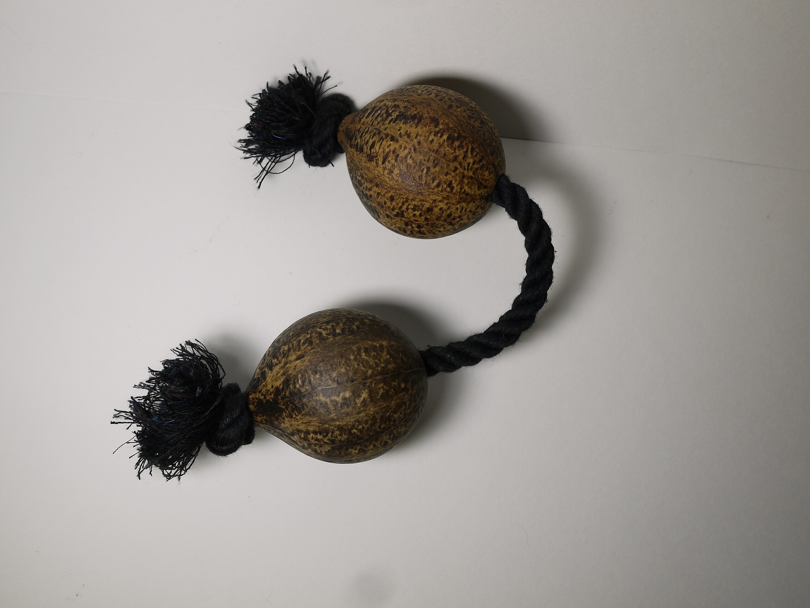
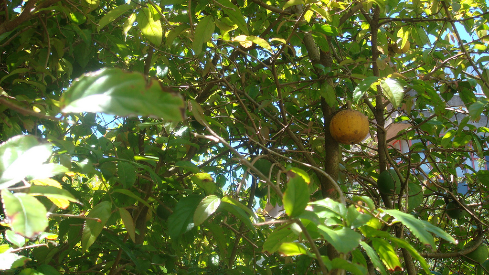

class: title

.content[
# Kashaka

<hr/>

## Joy of ~~Science~~ Math and Music 2025
## Darren Kessner

<br/> <br/> <br/> <br/>
<br/> <br/> <br/> <br/>
<br/>

  

### <br/> 
### <br/> 
### &nbsp;  Ellison Medical Institute   


]

---

layout:true

class: normal

.footer[
Ellison Medical Institute 
]

---

class: normal

# Kashaka
<hr/>

The _kashaka_ is a percussion instrument originating from West Africa.

It is made from the gourds of the _Oncoba spinosa_ tree.




Other names: aslato (Ghana), asalato, patica (Japan)


---

class: normal

# Counting
<hr/>

.row[
.column[

__Counting to 8__

```

4   4
|...|...


2 2 2 2
|.|.|.|.


3  3  2
|..|..|.


5    3
|....|..

```
]

.column[

__Counting to 16__

```

4   4   4   4
|...|...|...|...

3  3  3  3  4
|..|..|..|..|...
```

<br/>


__Counting to 6__

```

2 2 2
|.|.|.

3  3
|..|..

```

]
]


